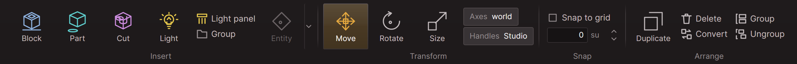

import { Steps } from '@astrojs/starlight/components';

A door that slides open when the player walks up to it takes three entities and one wire. [Entities and wiring](/concepts/entities-and-wiring/) explains both words.

Start with a project open in the editor and a new level: File, New level. A new level has a ground plate and a sun.

Everything you insert comes from the Build tab of the ribbon:

## With a trigger

<Steps>

1. Build a wall with a gap in it. Press Block to insert a block, then use Move and Size to make it one half of the wall. Do the same for the other half and leave a gap 2 units wide. A new block is 2 units on every side, so it shows you how wide that is.

   A room with a doorway cut into one wall works as well. See [Blocks, parts and cuts](/concepts/blocks-parts-and-cuts/).

2. Add a player start. Click the arrow beside Entity and pick Player start. It appears where you are looking, as a green diamond with an arrow. Move it a few units back from the gap, and use Rotate to point the arrow at the gap. The player starts there, facing along the arrow.

3. Make the door. Insert one more block. With it still selected, press Make entity in the Arrange group and pick Door. The block becomes a part, because only parts can move while a level plays.

   Move it into the gap and size it to fit.

4. Name the door. Type `Door` in the name box at the top of the Properties panel and press <kbd>Enter</kbd>. A wire finds an entity by its name.

5. Add a trigger. Click the arrow beside Entity and pick Trigger Once. It appears as a yellow outline: a volume that is not drawn and not solid. Move it onto the path between the player start and the door, and size it so the player can't walk round it.

6. Wire the trigger to the door. With the trigger selected, find Sends near the bottom of the Properties panel and press Add. In the new wire:

   - pick `OnTrigger` from the list at the top
   - type `Door` beside Target, or press the `...` button and pick it
   - type `Open` beside Input

   Press <kbd>Enter</kbd> after each one you type.

   The same wire can be made by dragging from the trigger's card onto the door's card in the Logic view. See [See and wire a level's logic](/guides/see-and-wire-a-levels-logic/).

7. Press Play, or <kbd>F8</kbd>. Walk forward with <kbd>W</kbd>. The door slides up when you reach the trigger.

8. Press <kbd>F8</kbd> or <kbd>Esc</kbd> to stop. The door is back where you built it. Stop before you save: the editor does not save a level while it plays.

</Steps>

The door closes by itself after 4 seconds, and a Trigger Once fires only the first time. So the door opens once and stays shut after that. If you are standing in the doorway when it closes, it opens again and waits another 4 seconds.

To keep it open, select the door and set Wait to -1. To have it open every time the player walks in, use a Trigger Multiple in place of the Trigger Once.

## If the door does not open

Look at the wire first. A wire whose target matches nothing says so underneath, for example `Nothing here is named 'Dor'`.

Then open the Problems panel: View, Panels, Problems. A door that still has a block inside it cannot move, and the panel lists it with the fix.

To see the wire fire, press <kbd>Ctrl</kbd> + <kbd>L</kbd> to open the Logic view, select the trigger and press Play. The wire lights up when it fires, and one that finds no door says `missed`. See [See and wire a level's logic](/guides/see-and-wire-a-levels-logic/).

The console tells the same story in lines. Open the Console panel, type `ent_watch on` and then press Play. Every output that fires and every input that arrives prints a line. The lines are explained in [Console](/reference/console/).

You can also open the door by hand. While the level plays, press <kbd>&#96;</kbd>, type `ent_fire Door Open` and press <kbd>Enter</kbd>. If that opens it, the door is fine and the fault is in the trigger or the wire.

## With a button

A button is pressed by the player instead of walked into.

<Steps>

1. Select the trigger and press <kbd>Del</kbd>.

2. Click the arrow beside Entity and pick Button. It appears as a part 2 units on every side. Size it down to a small plate and move it onto the wall beside the door.

3. Check which way it goes in. A button goes in along its own negative Z axis, by its depth less a small lip. If that is not into the wall, rotate the button, or change Move direction in the Properties panel.

4. Wire the button to the door. With the button selected, press Add under Sends, pick `OnPressed`, type `Door` beside Target and `Open` beside Input.

5. Press Play. Walk up to the button, look at it and press <kbd>E</kbd>. You have to be within 2 units.

</Steps>

The button comes back out after a second and can be pressed again. Send `Toggle` in place of `Open` and a press on an open door closes it.

Every setting, input and output of these classes is listed in [Mover entities](/reference/mover-entities/) and [Trigger entities](/reference/trigger-entities/).
