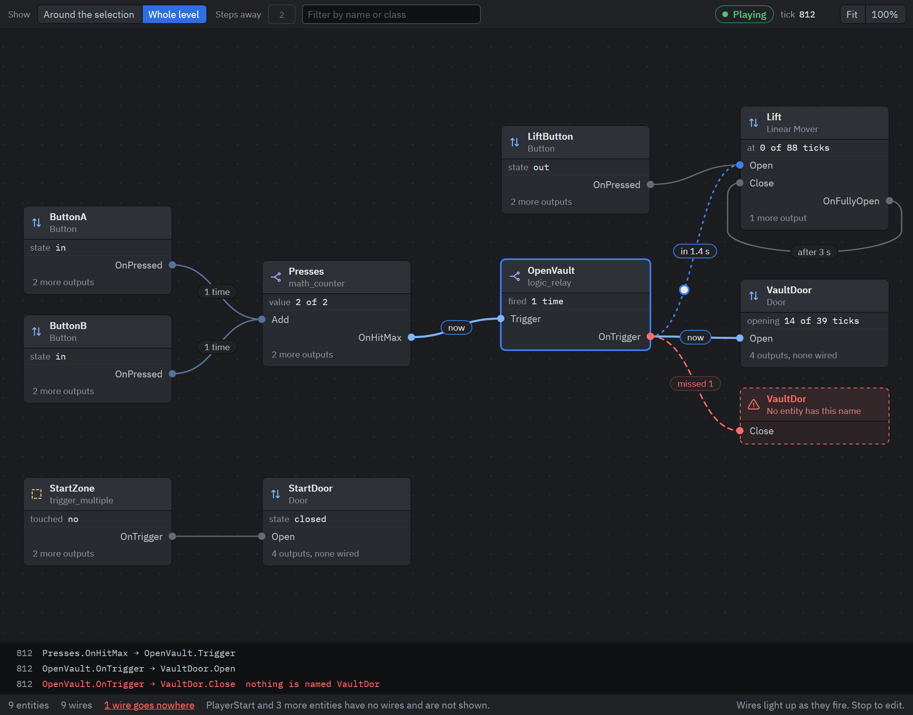

import { Steps } from '@astrojs/starlight/components';

The Properties panel shows one entity's wires at a time. The Logic view shows how they join up: every entity is a card, and every wire is a line from an output to an input. [Entities and wiring](/concepts/entities-and-wiring/) explains both words.

## Open it

Press <kbd>Ctrl</kbd> + <kbd>L</kbd>. The view opens below the viewport. Press it again to hide it.

View, Logic view has the same three choices by name: Below the viewport, Beside the viewport and Hidden. <kbd>Ctrl</kbd> + <kbd>L</kbd> brings the view back where it last was. Drag the border between the two views to give one of them more room.

## What it shows

A card is one entity. Its first line is the entity's name, its second the class. Under those, inputs that a wire reaches are on the left and outputs that have a wire are on the right. A line such as `2 more outputs` counts the outputs the class has that nothing is wired to.

A wire runs from an output to an input. The label on it says what the wire carries beyond that:

| Label | Means |
|---|---|
| `"2"` | The parameter it sends. |
| `after 3 s` | Its delay. |
| `once` | It fires one time. |
| `4 times` | It fires that many times. |

A wire that can never arrive is drawn red and dashed. It ends at a red card that says why, for example that no entity has the name the wire is aimed at. The status row under the graph counts these. Click the count to select the entity that sends the first of them and bring its card to the middle.

A wire aimed at `!activator` ends at a card for the activator, since nobody knows who that is until the level plays.

## Choose what to look at

The keys at the top left pick between two pictures.

**Around the selection** shows the selected entities and what is wired to them. Steps away says how far to follow the wires, from 1 to 6. At 1 you see what the selection sends to and what sends to it. This is the picture to work in: select a door in the viewport and the view shows what opens it.

**Whole level** shows every entity that has a wire. Entities that share no wire with each other are laid out as separate groups. The status row says how many entities have no wires and so no card.

Type in the filter box and the cards that do not match the name or the class fade. Nothing moves, so you do not lose your place.

Fit shows the whole graph. 100% shows it at its own size. The wheel zooms toward the cursor, and a drag on empty space pans.

Click a card to select its entity, in the viewport and the scene tree too. Double-click a card to frame the entity in the viewport.

## Make a wire

<Steps>

1. Give the receiving entity a name, if it has none. A wire finds an entity by its name, so a card with no name takes no wire.

2. Drag from an output on the sending card, and drop on the receiving card. A menu lists the inputs the receiver takes.

   You can also drag from anywhere else on the sending card. The menu then lists the sender's outputs first, and each opens the receiver's inputs.

3. Pick the input. The wire is there, and the sender is selected so the Properties panel shows the new wire under Sends.

</Steps>

A new wire has no parameter and no delay, and fires every time. Set those under Sends in the Properties panel.

An entity that has no wires yet has a card only while it is selected. Select it and you can drag from its card or drop onto it. To wire two entities that have none, select both: <kbd>Ctrl</kbd> + click the second one.

If several entities share the receiver's name, the menu says so: the wire reaches each of them.

<kbd>Esc</kbd> gives up a wire you are dragging. So does dropping it on empty space.

## Remove a wire

Click the wire, then press <kbd>Del</kbd>. Or right-click it and pick Remove wire.

Making a wire and removing one are each one undo step.

## Watch it run

Press Play. The view stays as it is and starts showing what happens:

- A wire lights up when it fires, with `now` on it. Afterwards it says how often it has fired: `1 time`, `2 times`.
- A wire with a delay turns dotted while its input is on the way, with a dot that travels along it and the time left, such as `in 1.4 s`.
- A wire that found nobody to deliver to says `missed 1`. One whose receiver has no such input says `refused 1`.
- Each card gains a line that says what its entity is doing: a door `opening 14 of 39 ticks`, a counter `value 2 of 2`, a button `state in`.
- The strip under the graph lists the last wires that fired, each with its tick. One that failed is red and says why.

Wires cannot be changed while the level plays. Stop, and the view is back to what you built.

The console prints the same story line by line with `ent_watch on`. See [Console](/reference/console/).

## Limits today

- The view lays the cards out itself. You cannot move a card.
- A level with many crossing wires is hard to read as a whole. Work around the selection there.
- The view shows the first 4,000 entities of a level and says so when there are more.
